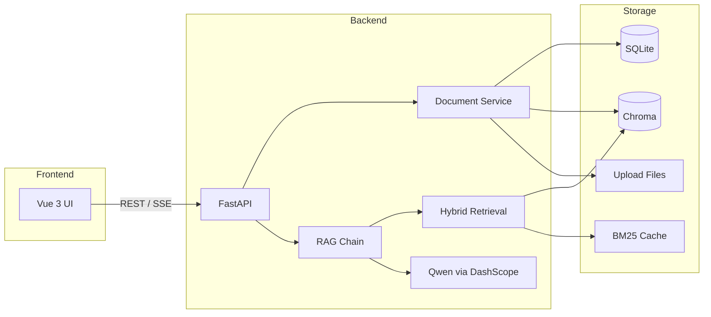

# 智问 · 知识库

基于 **RAG（检索增强生成）** 的私有知识库问答系统。上传 PDF / Word / TXT 文档后，可结合文档内容进行多轮对话，并展示可溯源的引用来源。

## 功能特性

- **文档管理**：上传、删除、单文档重建、整库后台重建
- **多轮对话**：SSE 流式输出，支持停止生成并保存已生成内容
- **混合检索**：向量检索（Chroma + MMR）+ BM25 关键词检索，RRF 融合
- **检索增强**：对话历史改写、多路查询扩展、DashScope Rerank 重排序（失败可降级）
- **引用溯源**：回答附带文档片段来源，前端去重并可折叠展示
- **健壮性**：结构化错误码、`request_id` 全链路日志、文档 `processing_version` 防 stale job、BM25 指纹校验缓存

## 技术栈

| 层级 | 技术 |
|------|------|
| 后端 | FastAPI、SQLAlchemy、LangChain、Chroma |
| 模型 | 通义千问（DashScope）、text-embedding-v3 |
| 前端 | Vue 3、Vite、Tailwind CSS |
| 存储 | SQLite、Chroma 向量库、本地文件上传目录 |

## 项目结构

```
knowledge/
├── backend/                 # FastAPI 后端
│   ├── app/
│   │   ├── api/             # REST / SSE 接口
│   │   ├── migrations/      # 启动时 SQLite schema 迁移
│   │   ├── models/          # ORM 模型
│   │   ├── services/        # RAG、检索、文档处理等
│   │   └── main.py          # 应用入口
│   ├── tests/               # 单元测试
│   ├── .env.example         # 环境变量示例
│   └── requirements.txt
├── frontend/                # Vue 3 前端
│   └── src/
└── .gitignore
```

## 环境要求

- Python **3.11+**（已在 3.13 下验证）
- Node.js **18+**
- [DashScope API Key](https://dashscope.console.aliyun.com/)（通义千问 + Embedding）

## 快速开始

### 1. 克隆项目

```bash
git clone https://github.com/<你的用户名>/<仓库名>.git
cd knowledge
```

### 2. 后端

```bash
cd backend

# 创建并激活虚拟环境（Windows）
python -m venv venv
venv\Scripts\activate

# 安装依赖
pip install -r requirements.txt

# 配置环境变量
copy .env.example .env
# 编辑 .env，填入 DASHSCOPE_API_KEY

# 启动 API（默认 http://127.0.0.1:8000）
uvicorn app.main:app --reload --host 0.0.0.0 --port 8000
```

首次启动会自动：

- 创建 `backend/data/`（SQLite、Chroma、上传文件、BM25 缓存）
- 执行 schema 迁移（老库自动补列）
- 初始化默认知识库

API 文档：http://127.0.0.1:8000/docs

### 3. 前端

```bash
cd frontend
npm install
npm run dev
```

浏览器访问 http://localhost:5173 。开发模式下 Vite 会将 `/api` 代理到后端 `8000` 端口。

### 4. 使用流程

1. 在左侧 **知识库** 上传文档，等待状态变为「已就绪」
2. 切换到 **智能对话**，输入问题
3. 查看流式回答与引用来源；出错时可复制 **请求 ID** 对照后端日志排查

## 配置说明

主要配置项见 `backend/.env.example`：

| 变量 | 说明 | 默认 |
|------|------|------|
| `DASHSCOPE_API_KEY` | 阿里云 DashScope 密钥 | 必填 |
| `QWEN_MODEL` | 对话模型 | `qwen-plus` |
| `EMBEDDING_MODEL` | 向量模型 | `text-embedding-v3` |
| `CHUNK_SIZE` / `CHUNK_OVERLAP` | 文档分块 | 800 / 120 |
| `RETRIEVAL_TOP_K` | 向量召回数量 | 5 |
| `RETRIEVAL_SEARCH_TYPE` | `similarity` 或 `mmr` | `mmr` |
| `MAX_HISTORY_TURNS` | 保留对话轮数 | 5 |

更多检索、混合搜索、Rerank 相关开关在 `backend/app/config.py` 中定义，可按需扩展 `.env`。

## 数据库迁移

项目使用轻量级启动迁移（非 Alembic），记录于 `schema_migrations` 表：

```bash
cd backend
python -m app.migrations status    # 查看迁移状态
python -m app.migrations upgrade     # 手动执行 pending 迁移
```

## 运行测试

```bash
cd backend
pip install -r requirements-dev.txt
python -m pytest tests -v
```

测试覆盖文件名清洗、`processing_version`、BM25 增删查、SSE 错误、stop 持久化、schema 迁移等，不依赖真实知识库数据。

## 架构概览



## 安全与发布

以下内容已在 `.gitignore` 中排除，**请勿提交到 GitHub**：

- `backend/.env`（含 API Key）
- `backend/data/`（数据库、向量、上传文件）
- `backend/venv/`、`frontend/node_modules/`

上传前建议执行 `git status`，确认无敏感文件。

## 生产部署提示

- 前端构建：`cd frontend && npm run build`，将 `dist/` 交由 Nginx 等静态服务托管，并反向代理 `/api` 到后端
- 后端建议使用 `uvicorn app.main:app --host 0.0.0.0 --port 8000`（生产可加 workers / 进程管理）
- 替换 SQLite 为 PostgreSQL 等需调整 `DATABASE_URL` 与迁移策略

## License

MIT（可按需修改）
